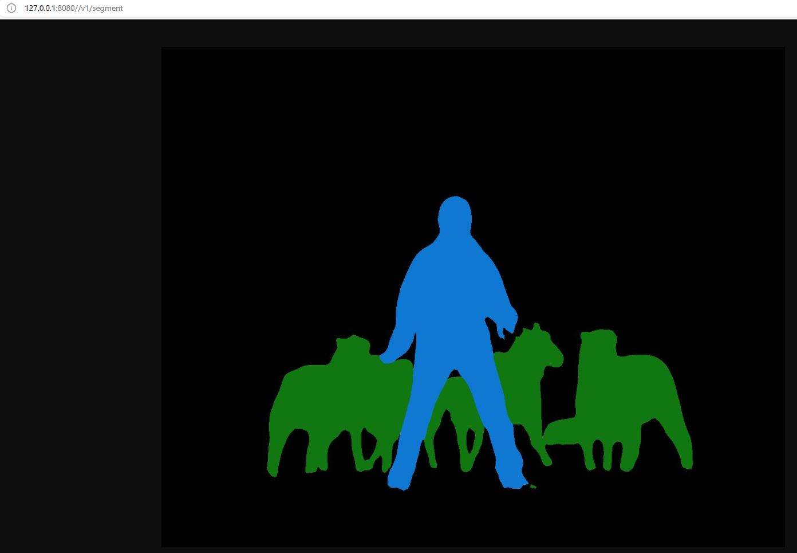

# flask-tutorial
Flask練習用リポジトリ<br>
画像セグメンテーションを実行し, ブラウザ上で表示




## 環境構築
Anacondaを使用
```
conda create -n imgseg python=3.8
pip install -r requirements.txt
```


## 実行方法
1. ターミナルで`python render.py`を実行

2. 起動後, [http://127.0.0.1:8080//v1/segment](http://127.0.0.1:8080//v1/segment)にアクセス

3. ブラウザ上で結果画像が表示(※処理時間がそこそこあるため, しばし待つ)

